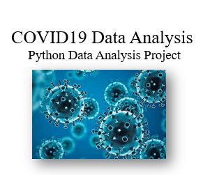

# COVID-19 Data Analysis

This project is designed to analyze data related to COVID-19. The analysis includes various statistics about the pandemic, such as infection cases, death toll, recoveries, and country-wise statistics.

## Project Overview

Data Set: The COVID-19 dataset includes global and country-level data collected over different time intervals.
Data Preprocessing: The data has been cleaned and transformed into a suitable format for analysis.

## Analyses:
Comparison of infection and death cases across different regions.
Estimation of the spread rate of COVID-19 in highly affected countries.
Regional statistics for recovery rates.
Visualization: The project includes various graphs, maps, and tables visualizing the data and insights derived.
Usage
To run the project, follow the steps below:

Install the required libraries:

## Download the data:
The data is located in the data/ folder. If the data is not available, you can download it from here.

## Run the analysis:
python datavisualing.py
Project Structure
graphql

## 📁 Project Structure

```
📁COVID-19-Data-Analysis/
│
├── 📁data/               # COVID-19 data
│   └── worldometer_data.csv  # Downloaded CSV data file
│
├── 📁src/                # Source code
│   └── datavisualing.py  # Visualization functions
├──📁visualtion-images/    
│      └── image.png
│      └── image-1.png 
│      └── image-2.png 
│      └── image-3.png 
│      └── image-4.png 
└── README.md          # Project information

```
Installation and Dependencies

## This project uses the following Python libraries:

-Pandas
-Matplotlib
-Seaborn
-Plotly
-Scikit-learn

To install these dependencies, run:
pip install pandas matplotlib seaborn plotly scikit-learn

## Additional Information

Data Source: The data is sourced from Our World in Data platform.
Notes: Key statistics of COVID-19 are highlighted throughout the analysis.

## Contact
If you have any questions, feel free to contact me at mywithcontact@gmail.com.




